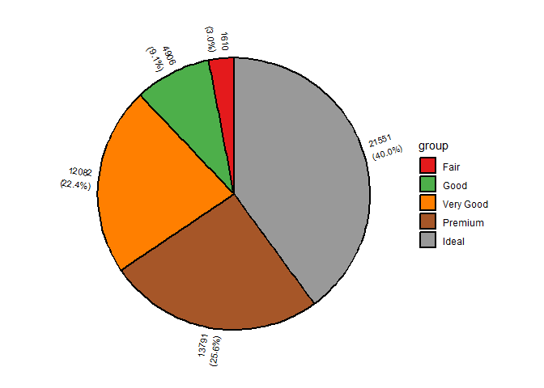
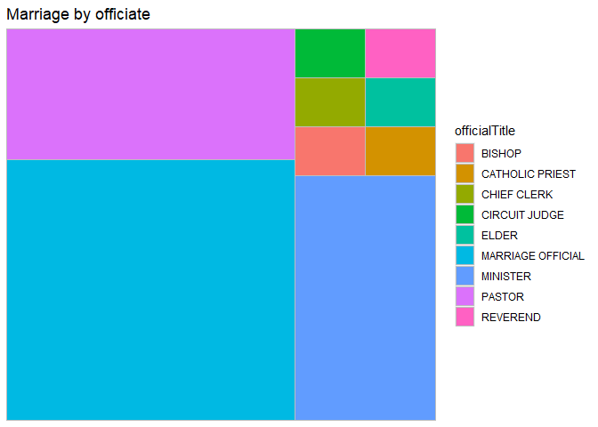
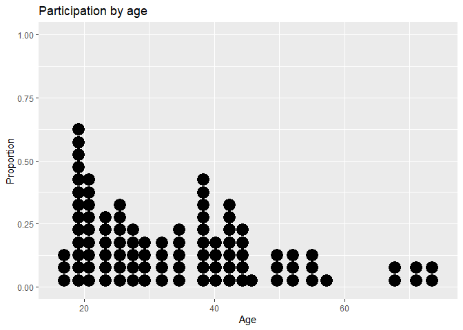
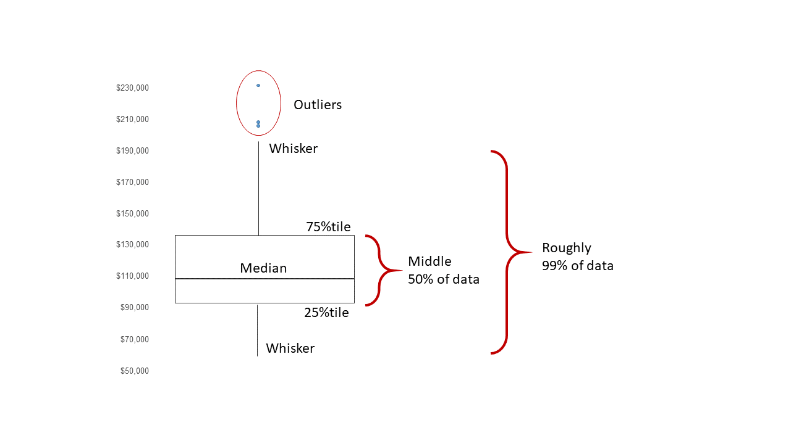
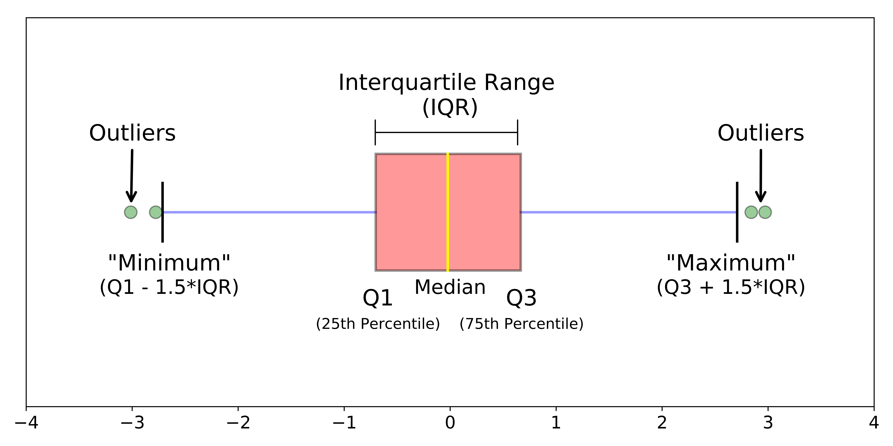

```{=html}
<style type="text/css">

body, td {
   font-size: 18px;
}
code.r{
  font-size: 12px;
}
pre {
  font-size: 12px
}
</style>
```


# Introdcution to *ggplot2*

*ggplot2* is a popular data visualization package in R, developed by Hadley Wickham. It's part of the tidyverse ecosystem and is widely used for creating elegant and customizable data visualizations. The name "ggplot2" stands for "Grammar of Graphics," emphasizing its underlying philosophy of representing data visualization as a structured grammar.

## Learn by examples

The functions in the ggplot2 package build up a graph in layers. We'll build a complex graph by starting with a simple graph and adding additional elements, one at a time.

The example dataset is a tips dataset downloaded from the source link [tips_dataset](https://www.kaggle.com/datasets/ranjeetjain3/seaborn-tips-dataset/download?datasetVersionNumber=1).

First lets import the data in R.


```r
setwd("E:/broadwaylearning/R-Training/Data_visualization in R")
tips <- read.csv("tips.csv")
```

In building a ggplot2 graph, only the first two functions described below are required. The others are optional and can appear in any order.

### ggplot package

The first function in building a graph is the ggplot function. It specifies the data frame to be used and the mapping of the variables to the visual properties of the graph. The mappings are placed within the **aes** function, which stands for aesthetics.


```r
# install if needed
if (!requireNamespace("ggplot2", quietly = TRUE)) {
  install.packages("ggplot2")
} # This code downloads and install the package only if it is not available before.
```

Let's start by looking at the relationship between tip and total bill.


```r
# Load library
library(ggplot2)

# specify dataset and mapping
ggplot(data = tips,
       mapping = aes(x = total_bill, y = tip))
```


We can see the empty box here. Because we have entered the x and y axis but did not specified what to show inside the graph. To specify it we have to add **geom()** to the plot.

### Geom

Geoms are the geometric objects (points, lines, bars, etc.) that can be placed on a graph. They are added using functions that start with geom_. In this example, we’ll add points using the geom_point function, creating a scatterplot.

In ggplot2 graphs function are chained together using the **+** sign to build a final plot.


```r
# add points on it 
ggplot(data = tips,
       mapping = aes(x = total_bill, y = tip)) +
  geom_point()
```


The figure explains that saturday has the highest bill amount paid by customers followed by sunday.

A number of parameters(options) can be specified in a geom_ function. Options for the geom_point function include color, size, and alpha. These control the point color, size, and transparency, respectively.

Transparency ranges from 0 (completely transparent) to 1 (completely opaque). Adding a degree of transparency can help visualize overlapping points.


```r
# Make color blue, larger points and semi transparent
ggplot(data = tips,
       mapping = aes(x = total_bill, y = tip)) +
  geom_point(color = 'blue',
             size = 2,
             alpha = 0.3)
```


Next, let’s add a line of best fit. We can do this with the geom_smooth function. Options control the type of line (linear, quadratic, nonparametric), the thickness of the line, the line’s color, and the presence or absence of a confidence interval. Here we request a linear regression (method = lm) line (where lm stands for linear model).


```r
# Make color blue, larger points and semi transparent
ggplot(data = tips,
       mapping = aes(x = total_bill, y = tip)) +
  geom_point(color = 'blue',
             size = 2,
             alpha = 0.3) +
  geom_smooth(method = "lm", color = 'black', se = TRUE)
```


### Grouping

In addition to mapping variables to the x and y axes, variables can be mapped to the color, shape, size, transparency, and other visual characteristics of geometric objects. This allows groups of observations to be superimposed in a single graph.

Let’s add sex status to the plot and represent it by color.


```r
# indicate sex using color
ggplot(data = tips,
       mapping = aes(x = total_bill, 
                     y = tip,
                     color = sex)) +
  geom_point(alpha = .5,
             size = 2) +
  geom_smooth(method = "lm", 
              se = FALSE, 
              size = 1.5)
```


The color = sex option is place in the aes function, because we are mapping a variable to an aesthetic (a visual characteristic of the graph). The geom_smooth option (se = FALSE) was added to suppresses the confidence intervals.

It appears that sex Male tend to provide higher tip than female.

### Scales

Scales control how variables are mapped to the visual characteristics of the plot. Scale functions (which start with scale_) allow you to modify this mapping. In the next plot, we’ll change the x and y axis scaling, and the colors employed.


```r
# modifying the axis and its scale
ggplot(data = tips,
       mapping = aes(x = total_bill, 
                     y = tip,
                     color = sex)) +
  geom_point(alpha = .5,
             size = 2) +
  geom_smooth(method = "lm", 
              se = FALSE, 
              size = 1.5) +
  scale_x_continuous(breaks = seq(0, 60, 10),
                     label = scales::dollar) +
  scale_y_continuous(breaks = seq(0, 10, 2),
                     label = scales::dollar) +
  scale_color_manual(values = c("red", 
                                "blue"))
```


We’re getting there. Here is a question. Is the relationship between total bill, tips and sex the same for each days?

Let’s repeat this graph once for each day status in order to explore this.

### Facet 

Facets reproduce a graph for each level a given variable (or pair of variables). Facets are created using functions that start with facet_. Here, facets will be defined by the days in the data.


```r
# adding days as facets
ggplot(data = tips,
       mapping = aes(x = total_bill, 
                     y = tip,
                     color = sex)) +
  geom_point(alpha = .5,
             size = 2) +
  geom_smooth(method = "lm", 
              se = FALSE, 
              size = 1.5) +
  scale_x_continuous(breaks = seq(0, 60, 10),
                     label = scales::dollar) +
  scale_y_continuous(breaks = seq(0, 10, 2),
                     label = scales::dollar) +
  scale_color_manual(values = c("red", 
                                "blue")) +
  facet_wrap(~day)
```


### Labels

Graphs should be easy to interpret and informative labels are a key element in achieving this goal. The labs function provides customized labels for the axes and legends. Additionally, a custom title, subtitle, and caption can be added.


```r
# adding labels to graph
ggplot(data = tips,
       mapping = aes(x = total_bill, 
                     y = tip,
                     color = sex)) +
  geom_point(alpha = .5,
             size = 2) +
  geom_smooth(method = "lm", 
              se = FALSE, 
              size = 1.5) +
  scale_x_continuous(breaks = seq(0, 60, 10),
                     label = scales::dollar) +
  scale_y_continuous(breaks = seq(0, 10, 2),
                     label = scales::dollar) +
  scale_color_manual(values = c("red", 
                                "blue")) +
  facet_wrap(~day) +
  labs(title = "Relationship between customer demographies and expenses",
       subtitle = "A resturant",
       caption = "Source : https://kaggle.com/",
       x = "Amount of expenses in resturant",
       y = "Amount of tip",
       color = "Gender of payer")
```


Now a viewer doesn’t need to guess what the labels expenses and age mean, or where the data come from.

### Theme

Finally, we can fine tune the appearance of the graph using themes. Theme functions (which start with theme_) control background colors, fonts, grid-lines, legend placement, and other non-data related features of the graph. Let’s use a cleaner theme.


```r
# Modify the theme of the grapgh
ggplot(data = tips,
       mapping = aes(x = total_bill, 
                     y = tip,
                     color = sex)) +
  geom_point(alpha = .5,
             size = 2) +
  geom_smooth(method = "lm", 
              se = FALSE, 
              size = 1.5) +
  scale_x_continuous(breaks = seq(0, 60, 10),
                     label = scales::dollar) +
  scale_y_continuous(breaks = seq(0, 10, 2),
                     label = scales::dollar) +
  scale_color_manual(values = c("red", 
                                "blue")) +
  facet_wrap(~day) +
  labs(title = "Relationship between customer demographies and expenses",
       subtitle = "A resturant",
       caption = "Source : https://kaggle.com/",
       x = "Amount of expenses in resturant",
       y = "Amount of tip",
       color = "Gender of payer")+
  theme_minimal()
```


## Graph as object

A ggplot2 graph can be saved as a named R object (like a data frame), manipulated further, and then printed or saved to disk.


```r
# create scatterplot and save it
myplot <- ggplot(data = tips,
                  aes(x = total_bill, y = tip)) +
             geom_point()
# plot the grapgh
myplot
```

<!-- -->


```r
# make the points larger and blue
# then print the graph
myplot <- myplot + geom_point(size = 2, color = "blue")
myplot
```

<!-- -->


```r
# print the graph with a title and line of best fit
# but don't save those changes
myplot + geom_smooth(method = "lm") +
  labs(title = "More simpler grapgh")
```

<!-- -->

# Univariate Graph
The initial phase of a thorough data analysis process involves examining each individual variable separately. Univariate graphs are used to visualize the distribution of data for a single variable, which can be either categorical (such as race, sex, or political affiliation) or quantitative (like age, weight, or income).

In this analysis, we will focus on exploring the distribution of three specific variables sourced from the "Marriage" dataset. These variables include the ages and racial backgrounds of the individuals involved in the weddings, as well as the occupations of the officials who officiated the weddings. The dataset in question pertains to the marriage records of 98 individuals in Mobile County, Alabama.

## Categorical 

The race of the participants and the occupation of the officials are both categorical variables.The distribution of a single categorical variable is typically plotted with a bar chart, a pie chart, or (less commonly) a tree map or waffle chart.

### Barchart

#### Count / Frequency
Bar chart is used to display the distribution of categorical variable.


```r
# Use base R 
# install.packages("mosaicData")
library(mosaicData)

# plot with base R
# Plotting with base R requires the frequency table of the categorical variable.

barplot(table(Marriage$race),
        xlab = "Race",
        ylab = "Frequency")
```


It's always better to graph using ggplot2 because it has better visualization technique and customizing options.


```r
# Barplot using ggplot2
library(ggplot2)
library(mosaicData)

ggplot(data = Marriage,
       mapping = aes(x = race, y = after_stat(count))) +
  geom_bar(fill = 'lightblue',
           color = 'black') +
  labs(x = "Race",
       y = "Frequency",
       title = "Participating by race")
```


#### Parcent 

Bars can represent percentage in value (y-axis) rather than count or frequency. For bar charts, the code aes(x=race) is actually a shortcut for aes(x = race, y = after_stat(count)), where count is a special variable representing the frequency within each category. You can use this to calculate percentages, by specifying y variable explicitly.


```r
# Barplot using ggplot2
library(ggplot2)
library(mosaicData)

ggplot(data = Marriage,
       mapping = aes(x = race, y = after_stat(count/sum(count)))) +
  geom_bar(fill = 'lightblue',
           color = 'black') +
  labs(x = "Race",
       y = "Frequency",
       title = "Participating by race")+
  scale_y_continuous(labels = scales::percent)
```


#### Sorting categories

It is often helpful to sort the bars by frequency. In the code below, the frequencies are calculated explicitly. Then the reorder function is used to sort the categories by the frequency. The option stat="identity" tells the plotting function not to calculate counts, because they are supplied directly.


```r
# calculate number of participants in each race category
library(dplyr)
```

```
## 
## Attaching package: 'dplyr'
```

```
## The following objects are masked from 'package:stats':
## 
##     filter, lag
```

```
## The following objects are masked from 'package:base':
## 
##     intersect, setdiff, setequal, union
```

```r
library(mosaicData)
plot_data <- Marriage %>% 
  count(race)
knitr::kable(plot_data, caption = "Number of participants in each race", digits = 2)
```


Table: Number of participants in each race

|race            |  n|
|:---------------|--:|
|American Indian |  1|
|Black           | 22|
|Hispanic        |  1|
|White           | 74|

Now use this data set to graph the plot


```r
# plot the grapgh using new dataset 

ggplot(data = plot_data,
       mapping = aes(x = reorder(race,n), y =n ))+
  geom_bar(stat = "identity") +
  labs(x = "Race",
       y = "frequency",
       title = "participants by race")
```


You can change code reorder(race,n) to reorder(race,desc(n)) or reorder(race,-n)to invert the bar plot so that higher value come first.

#### labelling the bars

You may want to see the label in each bar for better visualization. To do so use ***geom_text()*** function.


```r
# plot the bars with numeric labels
ggplot(plot_data, 
       aes(x = race, y = n)) + 
  geom_bar(stat="identity") +
  geom_text(aes(label = n), vjust=-0.35) +
  labs(x = "Race", 
       y = "Frequency", 
       title  = "Participants by race")
```


Here geom_text adds the labels, and vjust controls vertical justification.

Putting these ideas together, you can create a graph like the one below. The minus sign in reorder(race, -pct) is used to order the bars in descending order.


```r
library(dplyr)
library(scales)
plot_data <- Marriage %>%
  count(race) %>%
  mutate(pct = n / sum(n),
         pctlabel = paste0(round(pct*100), "%"))

# plot the bars as percentages,in descending order with bar labels
ggplot(plot_data, 
       aes(x = reorder(race, -pct), y = pct)) + 
  geom_bar(stat="identity", fill="indianred3", color="black") +
  geom_text(aes(label = pctlabel), vjust=-0.25) +
  scale_y_continuous(labels = scales::percent) +
  labs(x = "Race", 
       y = "Percent", 
       title  = "Participants by race")
```

<!-- -->
#### Overlapping labels

category labels may overlap if thee are many categories or the labels are long. Consider the distribution of marriage officials.


```r
# basic bar chart with overlapping labels
ggplot(Marriage, aes(x=officialTitle)) + 
  geom_bar(fill="lightblue", color="black") +
  labs(x = "Officiate",
       y = "Frequency",
       title = "Marriages by officiate")
```


You can flip the x and y axes with the **coord_flip()** function.


```r
# horizontal bar chart
ggplot(Marriage, aes(x = officialTitle)) + 
  geom_bar(fill = 'lightblue', color = 'black') +
  labs(x = "",
       y = "Frequency",
       title = "Marriages by officiate") +
  coord_flip()
```


Sometimes its better to rotate the x labels.

```r
ggplot(data = Marriage,
       mapping = aes(x = officialTitle)) +
  geom_bar(fill = 'lightblue', color = 'black')+
  labs(x = "",
       y = "Frequency",
       title = "Marriages by officiate") +
  theme(axis.text.x = element_text(angle = 45,
                                   hjust = 1))
```


Finally, you can try staggering the labels. The trick is to add a newline to every other label.


```r
# bar chart with staggered labels
lbls <- paste0(c("","\n"), levels(Marriage$officialTitle))

ggplot(Marriage,
       aes(x=factor(officialTitle,
                    labels = lbls))) +
  geom_bar() +
  labs(x = "",
       y = "Frequency",
       title = "Marriages by officiate")
```


### Pie chart

Pie charts are controversial in statistics. If your goal is to compare the frequency of categories, you are better off with bar charts and if your goal is compare each category with the the whole and the number of categories is small, then pie charts may work for you.

Pie charts are easily created with ggpie function in the ggpie package. The format is ggpie(data, variable), where data is a data frame, and variable is the categorical variable to be plotted.

#### Without label


```r
library(ggpie)
library(ggplot2)
# with no label
ggpie(
  data = diamonds, group_key = "cut", count_type = "full",
  label_info = "all", label_type = "none"
)
```


#### circle label and out of pie


```r
# circle label and out of pie
ggpie(
  data = diamonds, group_key = "cut", count_type = "full",
  label_info = "all", label_type = "circle",
  label_size = 3, label_pos = "out"
)
```

<!-- -->

#### circle label and in pie plot, with no split


```r
# circle label and in pie plot, with no split
ggpie(
  data = diamonds, group_key = "cut", count_type = "full",
  label_info = "all", label_type = "circle", label_split = NULL,
  label_size = 3, label_pos = "in"
)
```

<!-- -->

#### horizon label and in pie plot, with no split


```r
# horizon label and in pie plot, with no split
ggpie(
  data = diamonds, group_key = "cut", count_type = "full",
  label_info = "all", label_type = "horizon", label_split = NULL,
  label_size = 4, label_pos = "in"
)
```

<!-- -->

#### horizon label and in pie plot, split with space


```r
# horizon label and in pie plot, split with space
ggpie(
  data = diamonds, group_key = "cut", count_type = "full",
  label_info = "all", label_type = "horizon",
  label_size = 4, label_pos = "in"
)
```

<!-- -->

#### horizon label and out pie plot, with no split


```r
# horizon label and out pie plot, with no split
ggpie(
  data = diamonds, group_key = "cut", count_type = "full",
  label_info = "all", label_type = "horizon", label_split = NULL,
  label_size = 4, label_pos = "out"
)
```

<!-- -->

#### with label threshold


```r
# with label threshold
ggpie(
  data = diamonds, group_key = "cut", count_type = "full",
  label_info = "all", label_type = "horizon", label_split = NULL,
  label_size = 4, label_pos = "in", label_threshold = 10)
```

<!-- -->
These are the different type of style in ggpie for pi chart. This is the example in package documentation in R.

### Tree map

An alternative to the pie chart is a tree map. Unlike pie charts, it can handle categorical variables that have many levels. For this we need a *treemapify* package.


```r
if (!requireNamespace("treemapify", quietly = TRUE)) {
  install.packages("treemapify")
}
library(dplyr)
library(mosaicData)
library(treemapify)
library(ggplot2)

# create a treemap of marriage officials
plot_data <- Marriage %>%
  count(officialTitle)

ggplot(plot_data,
       aes(fill = officialTitle,
           area = n)) +
  geom_treemap() +
  labs(title = "Marriage by officiate")
```

<!-- -->

Now with better labels


```r
# create a treemap with tile labels
ggplot(plot_data, 
       aes(fill = officialTitle, 
           area = n, 
           label = officialTitle)) +
  geom_treemap() + 
  geom_treemap_text(colour = "white", 
                    place = "centre") +
  labs(title = "Marriages by officiate") +
  theme(legend.position = "none")
```

<!-- -->

Now add label = n in aes to add the numbers in the tree map.


```r
# create a treemap with tile labels
ggplot(plot_data, 
       aes(fill = officialTitle, 
           area = n, 
           label = paste0(officialTitle," ",n))) +
  geom_treemap() + 
  geom_treemap_text(colour = "white", 
                    place = "centre") +
  labs(title = "Marriages by officiate") +
  theme(legend.position = "none")
```

<!-- -->

### Wafle Chart

A waffle chart, sometimes called a gridplot or square pie chart, is a visualization that presents data using squares in a grid, where each square represents a portion or percentage of the whole. In R, you can construct a waffle chart using the geom_waffle function from the waffle package.

Now, let's create a waffle chart to visualize the distribution of wedding officiant professions. As with tree maps, we begin by summarizing the data into groups and counting the occurrences of each profession.

Let’s create a waffle chart for the professions of wedding officiates. As with tree maps, start by summarizing the data into groups and counts.


```r
library(dplyr)
plot_data <- Marriage %>%
  count(officialTitle)
```

Next, create the ggplot2 grapgh. Set *fill* to the grouping variables and *values* to the counts. Don't specify an *x* and *y*.\

The following code produces the default waffle plot.


```r
# create a basic waffle chart
if (!requireNamespace("waffle", quietly = TRUE)) {
  install.packages("waffle")
}
library(waffle)
ggplot(plot_data, aes(fill = officialTitle, values=n)) +
  geom_waffle(na.rm=TRUE)
```

<!-- -->

## Quantitative

In the Marriage dataset, age is quantitative variable. The distribution of a single quantitative variable is typically plotted with a histogram, kernel density plot, or dot plot.

### Histogram

Histograms are the most common approach to visualizing a quantitative variable. In a histogram, the values of a variable are typically divided up into adjacent, equal width ranges(bins), and the number of observations in each bin is plotted with a vertical bar.


```r
library(ggplot2)
library(mosaicData)

# plot the age distribution using histogram

ggplot(Marriage, aes(x = age)) +
  geom_histogram() +
  labs(title = "Partipants by age",
       x = "Age(Y)")
```


Histogram colors can be modified using two options

- fill : fill color for the bars
- color : border color around the bars


```r
# plot the histogram with blue bars and white borders
ggplot(Marriage, aes(x = age)) +
  geom_histogram(fill = "cornflowerblue", 
                 color = "white") + 
  labs(title="Participants by age",
       x = "Age")
```


#### Bins and bandwidths

The "bins" parameter is a crucial option when creating histograms as it determines how many intervals or bars the numeric variable is divided into. By adjusting the number of bins, you can gain a clearer understanding of the data distribution. The default value is typically set at 30, but experimenting with smaller or larger values can provide valuable insights into the shape and characteristics of the distribution.


```r
# plot the histogram with 10 bins
ggplot(data = Marriage,
       aes(x = age)) +
  geom_histogram(fill = "lightblue",
                 color = "white",
                 bins = 10) +
  labs(title = "Participants by age",
       subtitle = "number of bins = 20",
       x = "Age")
```


Or, you can specify the binwidth, the width of the bins represented by the bars.


```r
# plot the histogram with blue bars and white borders
ggplot(Marriage, aes(x = age)) +
  geom_histogram(fill = "cornflowerblue", 
                 color = "white") + 
  labs(title="Participants by age",
       x = "Age")
```


#### Bins and bandwidths

The "bins" parameter is a crucial option when creating histograms as it determines how many intervals or bars the numeric variable is divided into. By adjusting the number of bins, you can gain a clearer understanding of the data distribution. The default value is typically set at 30, but experimenting with smaller or larger values can provide valuable insights into the shape and characteristics of the distribution.


```r
# plot the histogram with 10 bins
ggplot(data = Marriage,
       aes(x = age)) +
  geom_histogram(fill = "lightblue",
                 color = "white",
                 binwidth = 5) +
  labs(title = "Participants by age",
       subtitle = "binwidth = 5 years",
       x = "Age")
```


As with bar charts, the y-axis can represent counts or percent of the total.


```r
# plot the histogram with percentage on the y-axis
library(scales)

ggplot(data = Marriage,
       mapping = aes(x = age,
                     y = after_stat(count/sum(count))))+
  geom_histogram(fill = 'cornflowerblue',
                 color = 'black',
                 binwidth = 5) +
  labs(title = "A Percentage by age",
       y = "Percentage",
       x = "Age") +
  scale_y_continuous(label = scales::percent)
```


### Kernel density Plot

An alternative to a histogram is the kernel density plot. Technically, kernel density estimation is a non parametric method for estimating the probability density function of a continuous random variable (what??). Basically, we are trying to draw a smoothened histogram. Where the area under the curve equals one.


```r
# create a kernel density plot a age

ggplot(data = Marriage,
       mapping = aes(x = age)) +
  geom_density() +
  labs(title = "Participating by age")
```


The graph shows the distribution of scores. For example, the proportion of cases between 20 and 40 years old would be represented by the area under the curve between 20 and 40 on the x-axis.

As with previous charts, we can use fill and color to specify the fill and border colors.


```r
ggplot(data = Marriage,
       mapping = aes(x = age)) +
         geom_density(fill = 'red')+
         labs(title = "Particpation by age")
```


**Smoothing parameter** 

The degree of smoothness is controlled by the bandwidth parameter bw. To find the default value for a particular variable, use the bw.nrd0 function. Values that are larger will result in more smoothing, while values that are smaller will produce less smoothing.


```r
# default bandwidth for the age variable
bw.nrd0(Marriage$age)
```

```
## [1] 5.181946
```


```r
# Create a kernel density plot of age 
ggplot(data = Marriage,
       mapping = aes(x = age)) +
  geom_density(fill = 'deepskyblue',
               bw = 1) +
  labs(title = "participation by age",
       subtitle = "bandwidth = 1")
```

<!-- -->

### Dot chart

Another alternative to the histogram is the dot chart. Again, the quantitative variable is divided into bins, but rather than summary bars, each observation is represented by a dot. By default, the width of a dot corresponds to the bin width, and dots are stacked, with each dot representing one observation. This works best when the number of observations is small (say, less than 150).


```r
# Plot the age distribution using a dotplot
ggplot(data = Marriage,
       mapping = aes(x = age))+
  geom_dotplot() +
  labs(title = "Participation by age",
       y = "Proportion",
       x = "Age")
```



The *fill* and *color* options can be used to specify the fill and border color of each dot respectively.


```r
# Plot ages as a dot plot using 
# gold dots with black borders
ggplot(Marriage, aes(x = age)) +
  geom_dotplot(fill = "yellow", 
               color="blue") + 
  labs(title = "Participants by age",
       y = "Proportion",
       x = "Age")
```


# Bivariate Graphs

One of the most fundamental questions in research is "What is the relation ship between two variables i.e., A and B". Bivariate graphs display the relationship between two variables. The type of graph will depend on the measurement level of each variable (Categorical or quantitative).

## Categorical vs. Categorical

When plotting the relationship between two categorical variables, stacked, grouped or segmented bar charts are typically used.

In this section, we will look at the automobile characteristics contained in mpg dataset that comes with the ggplot2 package. It provides fuel efficiency data for 38 popular car models in 1998 and 2008.


```r
library(ggplot2)
# Stacked bar chart

ggplot(data = mpg,
       mapping = aes(x = class,
                     fill = drv)) +
  geom_bar(position = "stack")
```


From the Figure we can see for example, that the most common vehicle is the SUV. All 2 seater cars are rear wheel drive, while most, but not all SUVs are 4-wheel drive.

Stacked is the default, so the last line could have also been written as *geom_bar()*.

### Grouped bar chart

Grouped bar charts place bars for the second categorical variable side-by-side. To create a grouped bar plot use the position = "dodge" option.


```r
library(ggplot2)

ggplot(data = mpg,
       mapping = aes(x = class, fill = drv)) +
  geom_bar(position = "dodge")
```


Here all Minivars are front-wheel drive. By default, zero count bars are dropped and the remaining bars are made wider. This may not the behaviour we want. You can modify this using the position = position_dodge(preserve = "single")


```r
library(ggplot2)

# grouped barplot preserving zero count bars

ggplot(data = mpg,
       mapping = aes(x = class,
                     fill = drv)) +
  geom_bar(position = position_dodge(preserve = "single"))
```

<!-- -->
### Segmented bar chart 

A segmented barplot is a stacked barplot where each bar represents 100 percent. You can create a segmented bar chart using the position = "filled" option.


```r
library(ggplot2)

#bar plot, with each bar representing 100%
ggplot(data = mpg,
       aes(x = class,
           fill = drv)) +
  geom_bar(position = "fill") +
  labs(y = "Proportion")
```


This type of plot is particularly useful if the goal is to compare the percentage of a category in one variable across each level of another variable. For example, the proportion of front-wheel drive cars go up as you move from compact, to midsize, to minivan.

### Improving the color and labeling

You can additional options to improve color and labeling. In the graph below

- factor modifies the order of the categories for the class variable and both the order and the labels for the drive variable

- scale_y_continuous modifies the y-axis tick mark labels

- labs provides a title and changed the labels for the x and y axes and the legend

- scale_fill_brewer changes the fill color scheme

- theme_minimal removes the grey background and changed the grid color


```r
library(ggplot2)

# bar plot, with each bar representing 100%, 
# reordered bars, and better labels and colors
library(scales)
ggplot(mpg, 
       aes(x = factor(class,
                      levels = c("2seater", "subcompact", 
                                "compact", "midsize", 
                                "minivan", "suv", "pickup")),
           fill = factor(drv, 
                         levels = c("f", "r", "4"),
                         labels = c("front-wheel", 
                                    "rear-wheel", 
                                    "4-wheel")))) + 
  geom_bar(position = "fill") +
  scale_y_continuous(breaks = seq(0, 1, .2), 
                     label = percent) +
  scale_fill_brewer(palette = "Set2") +
  labs(y = "Percent", 
       fill="Drive Train",
       x = "Class",
       title = "Automobile Drive by Class") +
  theme_minimal()
```


Next, let’s add percent labels to each segment. First, we’ll create a summary dataset that has the necessary labels.


```r
# create a summary dataset

plot_data <- mpg %>%
  group_by(class, drv) %>%
  summarise(n = n()) %>%
  mutate(pct = n/sum(n),
         lbl = scales::percent(pct))
plot_data
```

```
## # A tibble: 12 × 5
## # Groups:   class [7]
##    class      drv       n    pct lbl  
##    <chr>      <chr> <int>  <dbl> <chr>
##  1 2seater    r         5 1      100% 
##  2 compact    4        12 0.255  26%  
##  3 compact    f        35 0.745  74%  
##  4 midsize    4         3 0.0732 7%   
##  5 midsize    f        38 0.927  93%  
##  6 minivan    f        11 1      100% 
##  7 pickup     4        33 1      100% 
##  8 subcompact 4         4 0.114  11%  
##  9 subcompact f        22 0.629  63%  
## 10 subcompact r         9 0.257  26%  
## 11 suv        4        51 0.823  82%  
## 12 suv        r        11 0.177  18%
```

Next, we'll use this dataset and the geom_txt function to add labels to each bar segment.


```r
# create segmented bar chart
# adding labels to each segment

ggplot(plot_data, 
       aes(x = factor(class,
                      levels = c("2seater", "subcompact", 
                                 "compact", "midsize", 
                                 "minivan", "suv", "pickup")),
           y = pct,
           fill = factor(drv, 
                         levels = c("f", "r", "4"),
                         labels = c("front-wheel", 
                                    "rear-wheel", 
                                    "4-wheel")))) + 
  geom_bar(stat = "identity",
           position = "fill") +
  scale_y_continuous(breaks = seq(0, 1, .2), 
                     label = percent) +
  geom_text(aes(label = lbl), 
            size = 3, 
            position = position_stack(vjust = 0.5)) +
  scale_fill_brewer(palette = "Set2") +
  labs(y = "Percent", 
       fill="Drive Train",
       x = "Class",
       title = "Automobile Drive by Class") +
  theme_minimal()
```

<!-- -->


## Quantitative Vs. Quantitative 

The relationship between two quantitative variables is typically displayed using scatter plot and line graphs.

### Scatter plot

The simplest way of two quantitative variable is a scatter plot, with each variable represented on an axis. Here we will use **salary** dataset.


```r
library(ggplot2)
library(carData)

data(Salaries, package = "carData")

# simple scatter plot
ggplot(Salaries,
       aes(x = yrs.since.phd, y = salary)) +
  geom_point()
```


As expected, salary tends to rise with experience, but the relationship may not be strictly linear. Note that salary appears to fall off after about 40 years of experience.

The geom_point function has options that can be used to change the

- color : point color
- size : point size
- shape : point shape
- alpha : point transparency. Transparency ranges from 0 (transparent) to 1 (opaque), and is a useful parameter when points overlap.

The functions scale_x_continuous and scale_y_continuous control the scaling on x and y axes respectively.

We can use these options and functions to create a more attractive scatter plot.


```r
# enhanced scatter plot
ggplot(data = Salaries,
       mapping = aes(x = yrs.since.phd, y = salary)) +
  geom_point(color = 'blue',
             size = 2,
             alpha = 0.8) +
  scale_y_continuous(label = scales::dollar,
                     limits = c(50000,250000)) +
  scale_x_continuous(breaks = seq(0,60,10),
                     limits = c(0,60))+
  labs(x = "years Since PhD",
       y = "",
       title = "Experience vs. Salary",
       subtitle = "9-month salary for 2008-2009")
```

<!-- -->

#### Adding best fit lines

It is often useful to summarize the relationship displayed in the scatter plot, using a best fit line. Many types of lines are supported, including linear, polynomial, and nonparametric (loess). By default, 95% confidence limits for these lines are displayed.


```r
# Scatter plot with linear fit line
library(ggplot2)
library(carData)
ggplot(data = Salaries,
       mapping = aes(x = yrs.since.phd,
                     y = salary)) +
  geom_point(color = "red")+
  geom_smooth(method = "lm")
```


Clearly, salary increases with experience. However, there seems to be a dip at the right end - professors with significant experience, earning lower salaries. A straight line does not capture this non-linear effect. A line with a bend will fit better here.

A polynomial regression line provides a fit line of the form

$$ \hat{y} = \beta_0 +\beta_1x +\beta_2x^2 + \beta_3x^3 +........ \tag{i}$$

Typically either a quadratic (one bend), or cubic (two bends) line is used. It is rarely necessary to use a higher order( >3 ) polynomials. Adding a quadratic fit line to the salary dataset produces the following result.


```r
# scatterplot with quadratic line of best fit
ggplot(Salaries, aes(x = yrs.since.phd, y = salary)) +
  geom_point(color= "red") +
  geom_smooth(method = "lm", 
              formula = y ~ poly(x, 2), 
              color = "black")
```


Finally, a smothened nonparametric fit line can often provide a good picture of relationship. The default in ggplot2 is a locally weighted scatterplot smoothing (loess).


```r
# Scatterplot with non parametric fit line
ggplot(Salaries, aes(x = yrs.since.phd, y = salary)) +
  geom_point(color= "red") +
  geom_smooth(color = 'black')
```


### Line plot

When one of the two variables represents time, a line plot can be an effective method of displaying relationship. For example, the code below displays the relationship between time (year) and life expectancy (lifeExp) in the United States between 1952 and 2007. The data comes from the gapminder dataset.


```r
library(gapminder)
library(ggplot2)

# Select a data only from a class
library(dplyr)
plot_data <- gapminder %>%
  filter(country  == "United States")
ggplot(data = plot_data,
       mapping = aes(x = year, y = lifeExp)) +
  geom_line()
```


Its hard to read all the points in the graph so lets add the points for better visualizations.


```r
# line plots with points and improved labeling
ggplot(data = plot_data,
       mapping = aes(x = year, y = lifeExp)) +
  geom_line(color = 'grey',
            size = 1.5) +
  geom_point(color = 'blue',
             size = 3) +
  labs(y = "Life Expectancy (year)",
       x = "Year",
       title = "Life Expectancy changes over time",
       subtitle = "United States (1952-2007)",
       caption = "Source : http//www.gapminder.org/data/")
```

<!-- -->

## Categorical vs Quantitative

When plotting the relationship between a categorical variable and a quantitative variable, a large number of graph types are available. These include bar charts using summary statistics, grouped kernel density plots, side-by-side box plots, side-by-side violin plots, mean/sem plots, ridgeline plots, and Cleveland plots. Each is considered in turn.

### Bar chart (on Summary statistics)

In previous sections, bar charts were used to display the number of cases by category for a single variable or for two variables. You can also use bar charts to display other summary statistics (e.g., means or medians) on a quantitative variable for each level of a categorical variable.

For example, the following graph displays the mean salary for a sample of university professors by their academic rank.


```r
# load required libraries
library(carData) # for dataset Salaries
library(dplyr)
library(ggplot2)

# calculate mean salary for each rank
plot_data <- Salaries %>%
  group_by(rank) %>%
  summarise(mean_salary = mean(salary))

#plot mean salary in bar chart
ggplot(plot_data,
       aes(x = rank, y = mean_salary)) +
  geom_bar(stat = "identity")
```


Lets make it more attractive and informative.


```r
# plot mean salaries in a more attractive fashion
library(scales)
ggplot(plot_data, 
       aes(x = factor(rank,
                      labels = c("Assistant\nProfessor",
                                 "Associate\nProfessor",
                                 "Full\nProfessor")), 
                      y = mean_salary)) +
  geom_bar(stat = "identity", 
           fill = "cornflowerblue") +
  geom_text(aes(label = dollar(mean_salary)), 
            vjust = -0.25) +
  scale_y_continuous(breaks = seq(0, 130000, 20000), 
                     label = dollar) +
  labs(title = "Mean Salary by Rank", 
       subtitle = "9-month academic salary for 2008-2009",
       x = "Rank (Position)",
       y = "Salary Amount")
```


### Grouped kernel Density plots 

One can compare groups on a numeric variable by superimposing kernel density plots in a single graph.


```r
# plot the distribution of salaries 
# by rank using kernel density plots
ggplot(Salaries, aes(x = salary, fill = rank)) +
  geom_density(alpha = 0.4) +
  labs(title = "Mean Salary by Rank", 
       subtitle = "9-month academic salary for 2008-2009",
       x = "Rank (Position)",
       y = "Salary Amount",
       fill = "Legend")
```

<!-- -->

### Box Plots

A boxplot displays the 25th percentile, median, and 75th percentile of a distribution. The whiskers (vertical lines) capture roughly 99% of a normal distribution, and observations outside this range are plotted as points representing outliers (see the figure below).



Side-by-side box plots are very useful for comparing groups (i.e., the levels of a categorical variable) on a numerical variable.




```r
# plot the distribution of salaries by rank using boxplots
ggplot(Salaries, aes(x = rank, y = salary)) +
  geom_boxplot() +
  labs(title = "Mean Salary by Rank", 
       subtitle = "9-month academic salary for 2008-2009",
       x = "Rank (Position)",
       y = "Salary Amount in Dollar")
```


Notched boxplots provide an approximate method for visualizing whether groups differ. Although not a formal test, if the notches of two boxplots do not overlap, there is strong evidence (95% confidence) that the medians of the two groups differ.


```r
# plot the distribution of salaries by rank using boxplots
ggplot(Salaries, aes(x = rank, y = salary)) +
  geom_boxplot(notch = TRUE, 
               fill = "cornflowerblue", 
               alpha = .7) +
  labs(title = "Salary distribution by rank")
```


With median Values in it 


```r
ggplot(data = Salaries, 
       mapping = aes(x = rank, y = salary)) +
  geom_boxplot(notch = TRUE,
               fill = 'lightblue',
               alpha = 0.5) +
  stat_summary(fun.data = "median_hilow", 
               geom = "text", 
               vjust = -0.35, 
               size = 2.5, 
               color = "black",
               aes(label = round(..y.., 2)))+
  labs(title = "Mean Salary by Rank", 
       subtitle = "9-month academic salary for 2008-2009",
       x = "Rank (Position)",
       y = "Salary Amount in Dollar")
```

```
## Warning: The dot-dot notation (`..y..`) was deprecated in ggplot2 3.4.0.
## ℹ Please use `after_stat(y)` instead.
## This warning is displayed once every 8 hours.
## Call `lifecycle::last_lifecycle_warnings()` to see where this warning was
## generated.
```

<!-- -->

